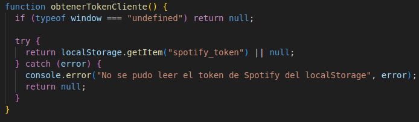
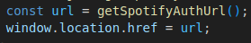
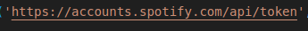
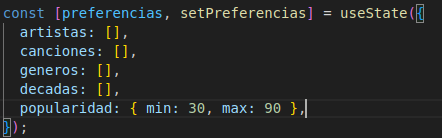
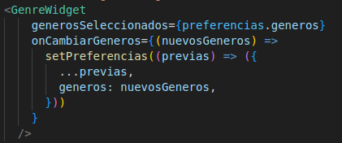
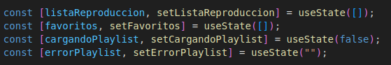
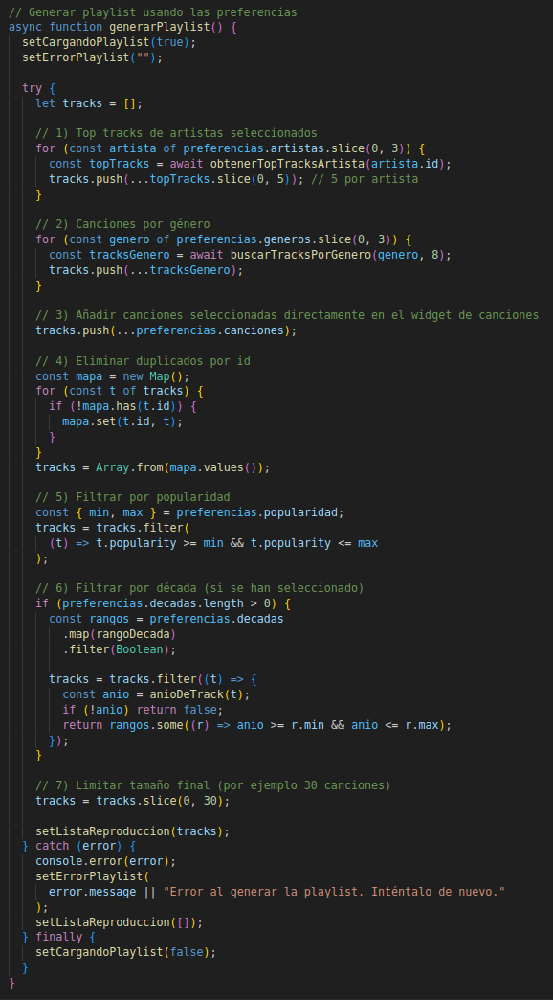
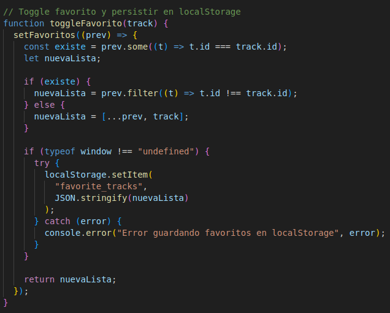
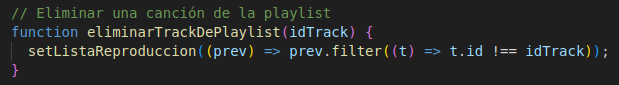

# 🎵 Spotify Taste Mixer

Proyecto final de **Programación Web I - Cliente**.

## Idea general

A nivel muy simple:

1. En la página de inicio solo se puede **iniciar sesión con Spotify**.
2. Spotify me devuelve un "code" y con eso consigo un **access_token** y un **refresh_token**.
3. Guardo esos tokens en localStorage.
4. En el '/dashboard':
   - Leo el token.
   - Pinto los widgets (géneros, décadas, popularidad, artistas, canciones).
   - Cuando el usuario pulsa “Generar playlist”, llamo a la API de Spotify y construyo una lista de temas con esa info.
   - Permito borrar canciones de la playlist y marcar favoritas (que también se guardan en localStorage).

## Organización del código tal y como está en el Readme proporcionado + mi archivo

```text

src/
├── app/
│   ├── page.js                # Inicio / login
│   ├── layout.js              # Layout general
│   ├── dashboard/
│   │   └── page.js            # Dashboard con los widgets y la playlist
│   ├── auth/
│   │   └── callback/
│   │       └── page.js        # Callback de Spotify (OAuth)
│   └── api/
│       ├── spotify-token/
│       │   └── route.js       # Intercambia el code por access + refresh token
│       └── refresh-token/
│           └── route.js       # Endpoint para refrescar el token
│
├── components/
│   ├── Cabecera.jsx           # Barra superior con título, botones y logout
│   ├── TrackCard.jsx          # Tarjeta de una canción dentro de la playlist
│   ├── PlaylistDisplay.jsx    # Componente que pinta la playlist completa
│   └── widgets/
│       ├── GenreWidget.jsx    # Widget de géneros
│       ├── DecadeWidget.jsx   # Widget de décadas
│       ├── PopularityWidget.jsx # Widget de popularidad
│       ├── ArtistWidget.jsx   # Widget de artistas (usa la API)
│       └── TrackWidget.jsx    # Widget de canciones (usa la API)
│
├── lib/
│   ├── auth.js                # Funciones relacionadas con login/tokens
│   └── spotify.js             # Funciones para hablar con la Web API de Spotify
│
└── app/globals.css            # Estilos globales y layout del dashboard

```

## Documentos

### lib/spotify.js – llamadas a la Web API

Este archivo es la “capa” que habla directamente con https://api.spotify.com.

Primero tengo una función interna para sacar el token del navegador:



A partir de ahí, todo lo demás se basa en este token.

Funciones principales:

buscarArtistasSpotify(terminoBusqueda):
Devuelve la lista de artistas que uso en el ArtistWidget.

buscarCancionesSpotify(terminoBusqueda)
Igual que la anterior, pero con type=track.
Lo uso en el TrackWidget.

obtenerTopTracksArtista(artistId, market = "ES"):
Devuelve las canciones más populares del artista.
Lo uso cuando genero la playlist a partir de los artistas seleccionados.

buscarTracksPorGenero(genero, limit = 10):
La idea general es que ningún componente React hace fetch directamente a Spotify:
siempre pasa por alguna función de lib/spotify.js.

### app/page.js – inicio y botón de login
Esta página es muy simple:

Muestra un texto de bienvenida y un botón tipo “Iniciar sesión con Spotify”.
Ese botón llama a una función handleLogin() que básicamente hace:



Aquí todavía no uso el token

### app/auth/callback/page.js – vuelta de Spotify

Esta ruta es la que pongo como redirect_uri en el panel de Spotify.

Cuando el usuario vuelve de Spotify, aquí hago:
``` text
-Leer code y state de la URL (searchParams).
-Comparar el state recibido con el que guardé en sessionStorage:
    -Si no coincide → error de CSRF, no sigo.
-Llamar a /api/spotify-token (ruta API de Next) pasando el code.
-Guardar access_token, refresh_token y tiempo de expiración usando funciones de lib/auth.js.
-Redirigir al /dashboard.
```
### app/api/spotify-token/route.js y refresh-token/route.js

Estas dos rutas son servidor puro (no se ejecutan en el navegador).

-spotify-token/route.js:
Recibe el code y hace un POST a:



con el client_id, client_secret, redirect_uri y el code.
Devuelve access_token, refresh_token y expires_in.

-refresh-token/route.js:
Hace lo mismo pero usando un refresh_token para pedir un access_token nuevo.
Está preparado para cuando el token caduque.

### app/dashboard/page.js – cerebro del panel

Este es el componente grande del proyecto. Aquí:
-Compruebo si el usuario está autenticado.
-Defino el estado global de preferencias.
-Cargo favoritos desde localStorage.
-Renderizo:
    -widgets a la izquierda,
    -PlaylistDisplay y favoritos a la derecha.

#### Estado de preferencias

Tengo algo tal que así:



Cada widget recibe la parte que le toca y una función para actualizarla, por ejemplo:



Tambien tengo:



En un useEffect inicial intento leer favorite_tracks del localStorage y rellenar favoritos.

### Widgets (components/widgets)

``` text

Cada widget es un componente React que:

-recibe estado vía props,
-avisa al padre cuando algo cambia.

``` 
#### GenreWidget.jsx

``` text

-Tiene el listado de géneros (array fijo).
-Un input para filtrar por texto.
-Botones tipo “chip” para seleccionar/deseleccionar.
-Límite de selección (por ejemplo 5 géneros).
-Llama a onCambiarGeneros(nuevaLista).

```
#### DecadeWidget.jsx
``` text

-Muestra botones 1950s, 1960s, ..., 2020s.
-Si haces click en uno lo mete/quita del array de decadas.
-Usa onCambiarDecadas(nuevasDecadas).

```
#### PopularityWidget.jsx
``` text
-Tres botones rápidos (Underground, Popular, Mainstream) que ponen valores predefinidos {min, max}.
-Un <input type="range"> para un ajuste más fino.
-Llama a onCambiarPopularidad({ min, max }).
```
#### ArtistWidget.jsx
``` text

-Input donde se escribe el nombre del artista.
-useEffect con debounce:
    -si el texto tiene menos de 2 caracteres, no hace nada;
    -si no, espera 500 ms y llama a buscarArtistasSpotify.
-Muestra lista de resultados (imagen + nombre + seguidores).
-Al clicar un artista:
    -Si ya estaba → lo quita.
    -Si no estaba y no paso del límite → lo añade.
-Devuelve la lista nueva con onCambiarArtistas.
```
#### TrackWidget.jsx (Track Widget del enunciado)
``` text
Este es el Track Widget del enunciado:

-Igual que el de artistas, pero para canciones:
    -Usa buscarCancionesSpotify.
    -Muestra portada + título + artistas + álbum.
-Las canciones seleccionadas se guardan en preferencias.canciones.
-Devuelve cambios con onCambiarCanciones.
```

### Generación de playlist (PlaylistDisplay)

La lógica de generación está en dashboard/page.js, y la parte visual está separada en components/PlaylistDisplay.jsx para no tener el page.js gigante.

#### Lógica en el dashboard

En dashboard/page.js tengo una función generarPlaylist que mezcla todo:



También tengo agregarMasCanciones para añadir más temas sin borrar la lista actual.

#### PlaylistDisplay.jsx
```text
PlaylistDisplay recibe todo lo que necesita como props:

-tracks → lista de canciones de la playlist.
-loading, error → estado de carga y error.
-onGenerate → función que llama a generarPlaylist.
-onAddMore → función que llama a agregarMasCanciones.
-isFavorite(trackId) → dice si una canción es favorita.
-onToggleFavorite(track) → marca/desmarca favoritas.
-onRemoveTrack(id) → borra una canción de la playlist.

Dentro, el componente:

-Muestra los botones para generar/añadir.
-Muestra mensajes de error o lista vacía.
-Recorre tracks y pinta un TrackCard por canción.
```

### TrackCard y favoritos
```text

components/TrackCard.jsx es la tarjeta de cada canción dentro de la playlist.

Recibe:

-track → el objeto devuelto por la API.
-esFavorito → booleano.
-onToggleFavorito(track) → para marcar/desmarcar.
-onEliminar(id) → para sacar la canción de la playlist.

En el dashboard, la función toggleFavorito hace algo así:
```



Y eliminarTrackDePlaylist:



En la parte de “Tus canciones favoritas” simplemente recorro favoritos y muestro nombre + artistas.

### Layout y estilos
```text
En app/globals.css tengo:

-Estilos base de la página (modo oscuro, tipografía, etc.).
-Estilos de la cabecera (Cabecera.jsx).
-Layout del dashboard:
    -En móvil:
        -.dashboard-contenedor es una columna (flex-direction: column).
    -En escritorio:
        -.dashboard-contenedor se convierte en dos columnas (flex-direction: row).
        -.dashboard-columna-izquierda = widgets.
        -.dashboard-columna-derecha = PlaylistDisplay + favoritos.
-Estilos de cada widget (cards, chips, inputs).
-Estilos de la playlist (PlaylistDisplay) y de las TrackCard.
```